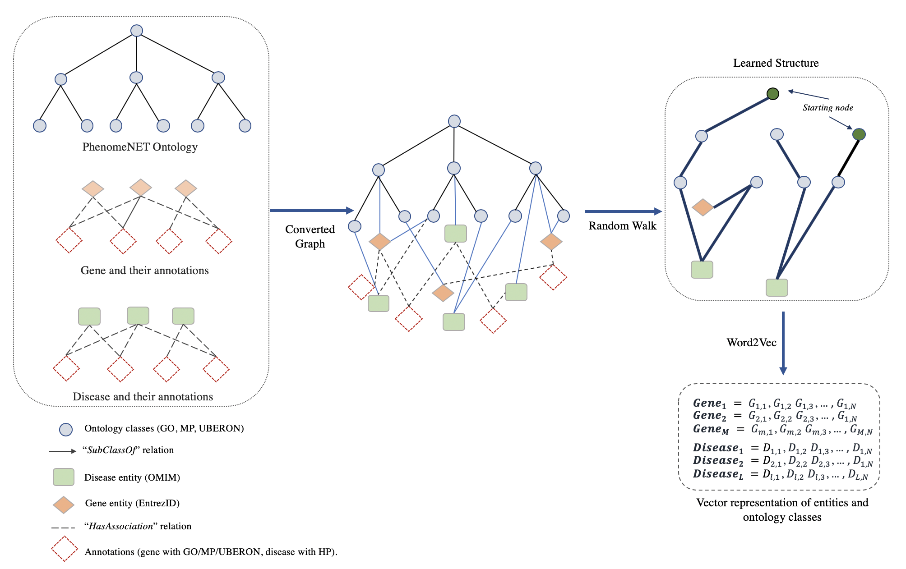

# DL2vec

DL2vec is a method that can convert different types of Description Logic axioms into graph representation, and then generate an embedding for each node and edge type.

The main covnertion tool is in DL2vec_embed folder.

## Required packages
python >= 3.4  
pandas >=0.24.2  
numpy >= 1.16.2  
torch >= 1.0.1  
networkx >= 2.3  
scipy >= 1.2.1  
scikit-learn >=0.20.3  
Groovy (Groovy Version: 2.4.10 JVM: 1.8.0_121) with [Grape](http://docs.groovy-lang.org/latest/html/documentation/grape.html) for dependency management.

## Experiment
Details for predicting gene-disease associations with DL2Vec can be found in the [experiment folder](https://github.com/bio-ontology-research-group/DL2Vec/tree/master/Experiment).

## Running DL2vec
1. Git clone this repository ``git clone https://github.com/bio-ontology-research-group/DL2Vec.git``
2. Generate the embeddings for each entity:

    ### Generate the embeddings
        python runDL2vec.py -ontology "ontology file" -associations "association_file" -outfile "embedding output file" -entity_list "entities list need generating embeddding"

Where the following are mandatory arguments:  
1. `ontology_file`: ontology file contains ontology in OWL format
2. `association_file`: file contains entity-class associations
3. `outfile`: output file contains the embedding model

If one of these two mandatory files is missing, an error message will be displayed  
you can also specify the following optional arguments: 
1. `-h/--help` show the help message and exit
2. `-window_size` : window size for Word2Vec
3. `-mincount` minimum count value for Word2Vec
4. `-entity_list`: the entity file in which each entity need to start the random walk and generate the embedding

## The main embedding learning process

    

## Output
The script will save a model that can generate embeddings for each entity.

## Reference
If you find DL2vec useful for your research, please cite:  
Chen, Jun, Azza Althagafi, and Robert Hoehndorf. "[Predicting candidate genes from phenotypes, functions, and anatomical site of expression." (2020)](https://academic.oup.com/bioinformatics/advance-article/doi/10.1093/bioinformatics/btaa879/5922810).

## Acknowledgement
We use two scripts which, [ProcessOntology.groovy](https://github.com/bio-ontology-research-group/DL2Vec/blob/master/DL2vec/ProcessOntology.groovy) and [getMetadata.groovy](https://github.com/bio-ontology-research-group/DL2Vec/blob/master/DL2vec/getMetadata.groovy) that are adapted from [OPA2vec](https://github.com/bio-ontology-research-group/opa2vec).
